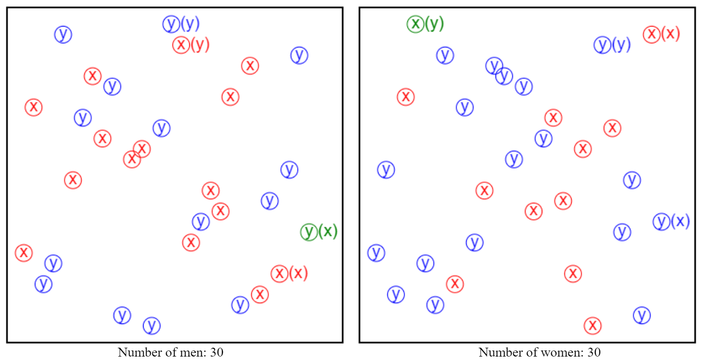

**Interactive demo:**
https://nmamano.github.io/TwoListStableMatching/index.html

**tldr:** an interactive tool to explore an open problem in algorithms known as the "two-list stable matching problem".

## Some background
The [stable matching / stable marriage problem](https://en.wikipedia.org/wiki/Stable_marriage_problem) is a central problem in market design. The setting is as follows: there are two sets of agents, traditionally callen "men" and "women", which need to be paired in a one-to-one matching. Each agent has its own list of all the agents in the other set, ordered according to its own *individual* preference. Given the preference lists of all the agents, the goal is to find a matching that is *stable*: a matching such that there is no pair consisting of a man and a woman who are not matched to each other, but both prefer each other over their assigned partners in the matching.

Gale and Shapley gave an optimal algorithm to find a stable matching. If *n* is the size of the sets, their algorithm runs in *O(n2)* time and finds a stable matching for *any* set of preference lists. It is optimal because it is known that, in the worst case, we may need to examine *O(n2)* entries in the preference lists.

## The two-list stable matching problem

First, consider a special case where all the men have exactly the same preferences, and, likewise, all the women have the same preferences. We call this the "one-list case", because there is a single preference list for each side (whereas, in the original setting, there can be *n* different lists for each side). It turns out that the special one-list case is trivial: to find a stable matching, we can simply match the most "popular" couple, and repeat. Thus, it can be solved in (optimal) *O(n)* time.

Consider now, the next, most natural setting: the two-list case. Now, among all the preference lists of the men, there are only two unique lists. Likewise, among all the preference lists of the women, there are only two unique lists.
**The open problem: what is the optimal time to compute a stable matching in the two-list case?** It was posed in the 2016 paper ["Subquadratic Algorithms for Succinct Stable Matching"](https://arxiv.org/pdf/1510.06452.pdf) by M Künnemann, D Moeller, R Paturi, and S Schneider.

The problem looks innocent: if the one-list setting is trivial, *surely* the two-list setting must be easier than the general (*n*-list) setting! Yet, to my knowledge, no progress has been made as of December 2019: 1) no algorithm better than the *O(n2)* Gale--Shapley algorithm is known, and 2) no lower bound above linear time is known.

## Geometric interpretation

My advisor suggested a geometric interpretation: think of each agent as point *(x,y)* in the plane. Then, each agent ranks the other set either by their *x*-coordinate or by their *y*-coordinate. This is an equivalent formulation of the problem.

This repository contains a little [interactive demo](https://nmamano.github.io/TwoListStableMatching/index.html) I created to explore this geometric interpretation and try to design algorithms. Often, it is possible to leverage the structure of geometric spaces to design algorithms, so this seemed like a promising direction. Maybe it will be useful for anyone looking to tackle the problem?

